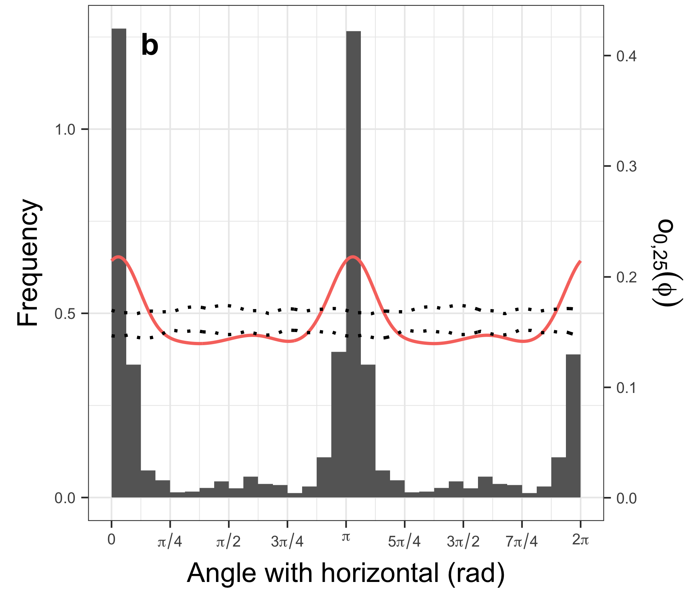
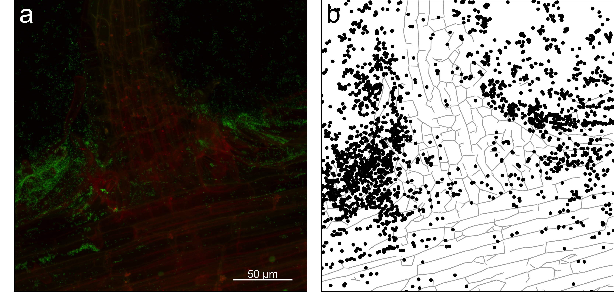
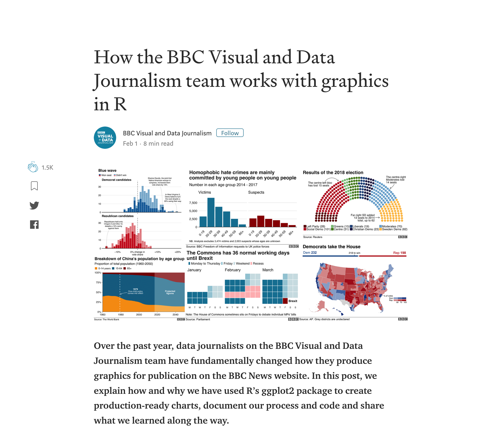
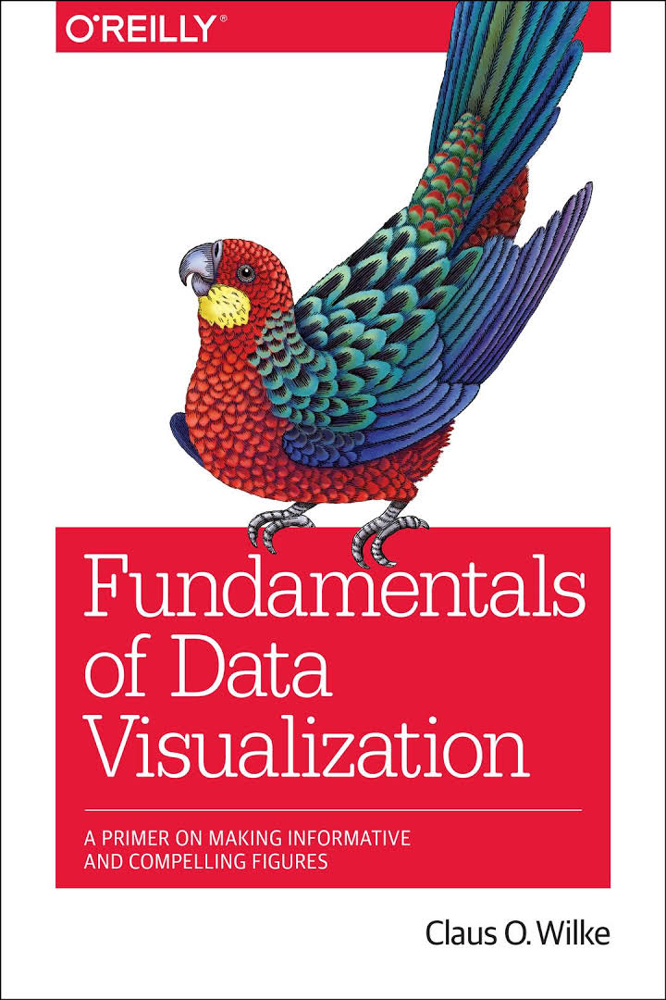
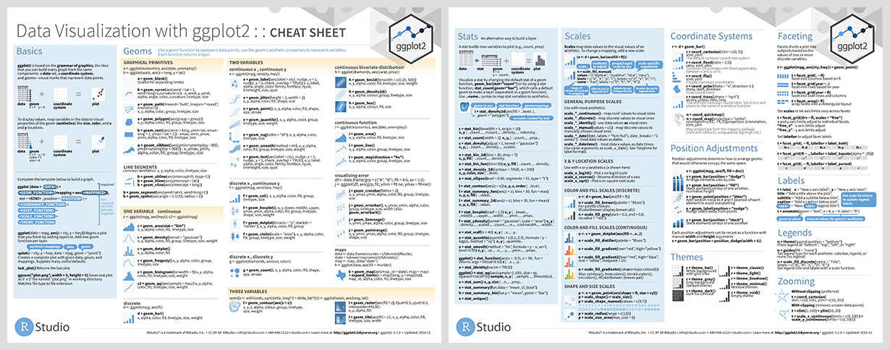
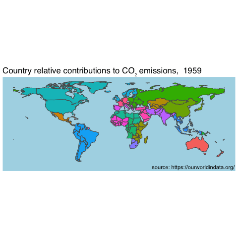

class: right, middle

```{r setup, include=FALSE} 
knitr::opts_chunk$set(echo = T, fig.width=4, fig.height=4, cache = F)
library(knitr)
library(ggthemes)
```

# Présentation générale

---
class: left, top
# Qu'est ce que **ggplot2**?

ggplot2: *Grammar of Graphics* plots (2ème version)

```{r library}
library(ggplot2)
```

* appartient au `tidiverse` (developpé par H Wickham),
* existe sur `R` depuis 10 ans,
* développement dynamique, version 3.0 sortie le 4 Juillet 2018,
* compatible avec les graphiques **grid**, incompatible avec les graphiques `base`,
* *Extensible* (possiblilité d'étendre les capacités de visualisation),
* *Themable* 

L'idée principale est de séparer le fond (type de visualisation des variables à observer) de la forme (axes, couleurs...).

---

# Exemples

```{r exemple2,out.width="250px", echo=F}

```
<br/>

<div style="text-align:right;">
```{r exemple1, out.width="550px", echo=F}

```
</div>

---
# A la pointe du progrès
```{r bbc, out.width="500px", echo=F}

```
https://medium.com/bbc-visual-and-data-journalism/how-the-bbc-visual-and-data-journalism-team-works-with-graphics-in-r-ed0b35693535
https://github.com/bbc/bbplot
---
# Ressources

.left-column[
```{r covers, out.width="110px", echo=F}
include_graphics("images/dv-cover-pupress.jpg")
include_graphics("images/ggplot.jpg")


```
]
.right-column[
- **Data Visualization: A practical introduction**, *K Healy*, Princeton Univ Press, http://socviz.co/

- **ggplot2: Elegant Graphics for Data Analysis**, *H Wickham*, Springer, https://github.com/hadley/ggplot2-book

- **Fundamentals of Data Visualization**, *C Wilke*, O'Reilly, https://serialmentor.com/dataviz/

- **StackOverflow**, www.stackoverflow.com

- **RStudio**, www.rstudio.com

<div style="text-align: right;">
```{r cheatsheet, out.width="350px", echo=F}

```
</div>
]

---

# Principes
.left-column[
```{r grammar, out.width="500px", echo=F}
include_graphics("images/ggplot-3.png")
```
]
.right-column[

On *additionne* des composants graphiques pour le fond (`ggplot()`, `geom_...()`) et la forme (`stats_...()`, `scale_...()`, `theme_...()`):

> **ggplot**(data=*données*, aes(x=*variable_x*, y=*variable_y*)) +
>  <br/>&nbsp;&nbsp;&nbsp;**geom_...**(aes(colour=...,shape=...)) +
>  <br/>&nbsp;&nbsp;&nbsp;**stats\_...**() + 
>  <br/>&nbsp;&nbsp;&nbsp;**scale\_...\_...**() + 
>  <br/>&nbsp;&nbsp;&nbsp;**theme**()


L'objet graphique est créé par la fonction `ggplot()` qui prend 2 arguments (facultatifs) `data=` et `aes=`.

Les autres éléments ajoutent des visualisations (nuages de points, barres...) ou modifie l'allure graphique générale.
]
---

# Les geoms
## Données

```{r df}
df = data.frame(V1 = runif(99), 
                V2 = rnorm(99,mean=rep(5:7,each=33)), 
                V3 = rep(LETTERS[1:3],each=33))
```

```{r dfshow, echo=F}
kable(head(df), format = "html",align='c')
```

---

# Geoms pour décrire une variable 
## `geom_boxplot()`

```{r boxplot, fig.show='hold'}
ggplot(data=subset(df,V3=="A"),aes(y=V2)) + geom_boxplot()

ggplot(data=df,aes(x=V3, y=V2)) + geom_boxplot()
```
---

# Geoms pour décrire une variable 
## `geom_jitter()`

```{r jitterplot, fig.show='hold'}
ggplot(data=df,aes(x=V3, y=V2)) + geom_jitter(width=0.30)
```

---

# Geoms pour décrire une variable 
## `geom_histogram()`

```{r histo, fig.show='hold',message=FALSE}
ggplot(data=subset(df,V3=="A"),aes(x=V2)) + geom_histogram(bins=20)
```

---

# Geoms pour décrire une variable 
## `geom_density()`

```{r density, fig.show='hold'}
ggplot(data=subset(df,V3=="A"),aes(x=V2)) +
  geom_density(fill="gray50", colour="gray50")
```

---

# Geoms pour décrire les liens entre variables 
## `geom_point()`

```{r points, fig.show='hold'}
ggplot(data=df,aes(x = V1, y=V2)) + geom_point()
ggplot(data=df,aes(x = V1, y=V2)) + geom_point(aes(colour = V3))
```

---

# Geoms pour décrire les liens entre variables 
## `geom_line()`, `geom_path()`

.pull-left[
```{r line,  fig.width=3.5, fig.height=3.5}
ggplot(data=df,aes(x = V1, y=V2)) + 
  geom_line(aes(colour = V3))
```
 
<div style="font-size: 10px;">
Points reliés par ordre croissant de `x`
</div>
]

.pull-right[
```{r path,  fig.width=3.5, fig.height=3.5}
ggplot(data=df,aes(x = V1, y=V2)) + 
  geom_path(aes(colour = V3))
```
<div style="font-size: 10px;">
Points reliés par ordre d'apparition dans le tableau de données
</div>
]


---

# Combiner les geoms
```{r combine, fig.show='hold', fig.width=5}
ggplot(data=df,aes(x = V1, y=V2)) +
  geom_point(aes(shape= V3)) +
  geom_line(aes(colour = V3))
```

---

# Geoms pour décrire les liens entre variables 
## `geom_bar()`

```{r bar, fig.show='hold'}
dfaggr = aggregate(df[,1:2], by=list(V3 = df$V3), mean)
ggplot(data=dfaggr,aes(x = V3,y=V2)) + geom_col() # ou geom_bar(stat='identity')
```

---

# Geoms pour décrire les liens entre variables 
## `geom_linerange()`, `geom_errorbar()`
```{r linerange, fig.show='hold'}
dfaggr$sd = aggregate(df[,2], by=list(V3 = df$V3), sd)$x
ggplot(data=dfaggr,aes(x = V3,y=V2)) + geom_col() +
  geom_errorbar(aes(ymin=V2-sd/sqrt(33), ymax = V2+sd/sqrt(33),width=0.2))
```
---
# Geoms pour représenter des surfaces
## `geom_rect(), geom_tile()`
```{r tile, fig.show='hold', fig.width=5}
ggplot(data=data.frame(
  expand.grid(x=1:dim(volcano)[1],y=1:dim(volcano)[2]),z=as.numeric(volcano)),
  aes(x=x,y=y,fill=z)) + 
  geom_tile()+coord_equal()
```

---
# Geoms pour représenter des surfaces
## `geom_ribbon()`
```{r ribbon,  fig.width=3.5, fig.height=3.5}
ggplot(data=df,aes(x = V1, ymin=V2/2, ymax=2*V2)) + 
  geom_ribbon()
```


---
# Geoms pour écrire du texte
## `geom_text()`
```{r text,  fig.width=3.5, fig.height=3.5}
ggplot(data=df,aes(x = V1, y=V2)) + 
  geom_text(aes(label=V3,colour=V3))
```


---
# Geoms pour les cartes
## `geom_sf()`

```{r carte,fig.width=12}
library(rnaturalearth)
wrld = ne_countries(returnclass="sf")
ggplot(wrld) + geom_sf(aes(fill=subregion))

```

---
# Pour annoter des graphiques
## `geom_hline()`, `geom_vline()`, `geom_abline()`

```{r hline, fig.show='hold'}
ggplot(data=df,aes(x = V1, y=V2)) +
  geom_line(aes(colour= V3)) +
  geom_hline(data = aggregate(df$V2,by=list(V3=df$V3),mean),
             aes(yintercept=x,colour=V3))
```
---
# Pour annoter des graphiques
## les fonctions `stat_...()`

.pull-left[
```{r stat, fig.show='hold',message=FALSE}
ggplot(data=df,aes(x = V1, y=V2)) + 
  geom_point() + 
  stat_smooth()
```
]
.pull-right[
```{r statlm, fig.show='hold',message=FALSE}
ggplot(data=df,aes(x = V1, y=V2)) + 
  geom_point() + 
  stat_smooth(method="lm")
```
]
---
# Pour annoter des graphiques
## les fonctions `stat_...()`
```{r stat2, fig.show='hold',message=FALSE}
ggplot(data=df,aes(x = V1, y=V2, group=V3)) + 
  geom_point(aes(colour=V3)) + 
  stat_smooth()
```

---
# Pour annoter des graphiques
## les fonctions `stat_...()`
```{r stat3, fig.show='hold',message=FALSE}
ggplot(data.frame(x=c(0,2*pi)),aes(x)) + 
  stat_function(fun=sin)
```


---
# Pour annoter des graphiques
## les fonctions `annotate`
```{r annotatetext}
ggplot(data=df,aes(x = V1, y=V2)) + geom_point(aes(colour = V3))+annotate("text",x=0.5,y=6,label="Secret",size=20,col="red",angle=30)
```
---
# facetting
##`facet_grid()`, `facet_wrap()`

```{r facet, fig.width=6}
ggplot(df,aes(x = V1, y=V2)) + geom_point() +  facet_grid(cols=vars(V3)) 
```

---
class: center, middle

# Mise en forme

---
class: left, top
# Graphique: 
Dans la suite, on va travailler à partir du graph suivant: 
```{r graph}
g = ggplot(data=df,aes(x = V1, y=V2)) + geom_point(aes(colour = V3))
```

```{r echo=F}
g
```

---
# Les échelles 
## Les axes: `scale_x,y_...()`

.pull-left[
```{r axelog}
g + 
  scale_x_log10()
```
]
.pull-right[
```{r axes, fig.show='hold'}
g + scale_x_continuous(
  limits = c(-5,5))
```
]
Attention: Cette manière de redéfinir les limites des axes *supprime* les données situées hors de cette gamme ! Il faut utiliser les arguments `xlim`et `ylim` de `coord_cartesian()` pour redéfinir les axes sans perdre de données. 

---

# Les échelles 
## couleurs : `scale_colour_...()`

.pull-left[
```{r default}
g
```
]
.pull-right[
```{r scalecolour}
g +  scale_colour_viridis_d()
```
]
---
# Les axes

.pull-left[
```{r}
ggplot(df,aes(x=V1,y=V2)) + 
  geom_line() 
```
]
.pull-right[
```{r coord}
ggplot(df,aes(x=V1,y=V2)) + 
  geom_line() + coord_polar()
```
]

---
# Les axes

.pull-left[
```{r}
ggplot(df,aes(x="")) + 
  geom_bar(aes(fill=V3)) 
```
]
.pull-right[
```{r pie}
ggplot(df,aes(x="")) + 
  geom_bar(aes(fill=V3)) +
  coord_polar("y",clip = "off",start=0)
```
]

---
# Les themes par defaut

.pull-left3[
```{r bw, fig.width=3, fig.height=2}
g + theme_bw()
```
]
.pull-left3[
```{r classic, fig.width=3, fig.height=2}
g + theme_classic()
```
]
.pull-left3[
```{r minimal, fig.width=3, fig.height=2}
g + theme_minimal()
```
]
Les thèmes `theme_...()` ne modifient que l'allure générale du graphique et ne modifient pas la couleur des points (définis via un `aes()`).
Il faut également modifier l'échelle de couleurs avec  `scale_colour_discrete()` si l'on veut un graph en noir & blanc, par exemple.

---
class: center, middle

# Pour aller plus loin

---
# Les themes `ggthemes`

.pull-left3[
```{r economist, fig.width=3, fig.height=2}
g + theme_economist()
```
]
.pull-left3[
```{r excel, fig.width=3, fig.height=2}
g + theme_excel_new()
```
]
.pull-left3[
```{r tufte, fig.width=3, fig.height=2}
g + theme_tufte()
```
]

---
# Les extensions
## Joy plots avec `ggridges`: 

```{r ggridges, message=FALSE, fig.width=6,fig.height=4}
library(ggridges)
norm_data <- data.frame(var = rep(1:5, each = 30))
norm_data$group <- factor(norm_data$var, levels=5:1)
norm_data$value <- rnorm(nrow(norm_data), norm_data$var,1)

ggplot(norm_data,aes(x=value,y=group,group=group,fill=group)) +
  geom_density_ridges(bandwidth=1)
```

---
# Les extensions
## Les plots classiques avec `GGally`

```{r GGally,fig.width=8,fig.height=5}
library(GGally)
ggpairs(df)
```

---
# Les extensions
## Les plots classiques avec `ggfortify`

```{r ggfortify,fig.width=8,fig.height=6}
library(ggfortify)
autoplot(lm(mpg~wt,data=mtcars))
```

---
# Rendre ses graphs interactifs
##`plot.ly`
```{r plotly,message=F}
library(plotly)
ggplotly(g)
```
---
# Animer des graphiques
## `gganimate` 

```{r gganimate1,message=FALSE, echo=F}
theme_set(theme_gray())
n=1000
df2 = data.frame(
  x=do.call("c",lapply(list(1,2,3), function(x) rnorm(n, sd=x))),
  y = rep(1:3,each=n)
  )
```

```{r gganimate2,message=FALSE, fig.height = 2.5}
library(gganimate)
animate(ggplot(df2,aes(x=x)) +  geom_density(bw=1, fill="gray50", colour="gray50") + theme(legend.position = 'none') +
  transition_manual(y)+
      ease_aes('linear') + labs(title = "sigma = {frame}"),height=400)

#  transition_states(y, transition_length = 3, state_length = 1, wrap=T) +
```
---
# Animer des graphiques
## `gganimate` 
.pull-left[

]
.pull-right[
```{r eval=F}
library(rnaturalearth)
library(cartogram)
library(sf)

read.csv("annual-co-emissions-per-country.csv", stringsAsFactors =F) -> co2

### Gros bout de code compliqué qui permet de générer une table sf 
###où chaque ligne correspond à un cartogramme, c'est à dire une carte
###où les surfaces des pays sont pondérées par leurs émissions

g = ggplot(wrldCo2[wrldCo2$year>0,]) + 
  geom_sf(aes(fill=subregion)) + coord_sf(datum = NA) +
  theme(text=element_text(size=14,  family="sans"),
        panel.grid = element_blank(),panel.grid.major = element_blank(),panel.grid.minor = element_blank(), panel.background = element_rect("lightblue"),axis.line=element_blank(),
        axis.text.x=element_blank(),axis.text.y=element_blank(),
        axis.ticks=element_blank(),axis.title.x=element_blank(),
        axis.title.y=element_blank(),legend.position="none") + 
  labs(title="Country relative contributions to CO\u2082 emissions,  {current_frame}") +
  annotate("text",x=14000000,y=-7000000,label="source: https://ourworldindata.org/") +
  transition_manual(year)
```
]
---
# Visualisations 3D 

.pull-left[
Supposons $$z = x^2 + 3\times y + \epsilon$$
]

.pull-right[
```{r data3d,echo=F}
x = runif(100,min=0,max=5)
y = runif(100,min=0,max=10)
z = x^2 + 3*y + runif(100, min = -5, max=5)

ggplot(data=data.frame(x=x,y=y,z=z),aes(x=x,y=z)) +  geom_point()
ggplot(data=data.frame(x=x,y=y,z=z),aes(x=y,y=z)) +  geom_point()

```
]

---
# Visualisations 3D 
## `rgl`
```{r rgl}
library(rgl)
plot3d(x,y,z)
rglwidget(width=400,height=400)
```
```{r echo=F}
rgl.close()
```
---
# Visualisations 3D 
## `rgl`

```{r rgl2}
plot3d(x,y,z,col=rep(1:4,each=25))
rglwidget(width=400,height=400)
```
```{r echo=F}
rgl.close()
```
---
# Visualisations 3D 
## `rgl`

```{r rgl3}
xseq = 0:5;yseq = 0:10
surf=expand.grid(x=xseq,y=yseq)
surfmat = matrix( surf$x^2 + 3*surf$y ,nrow=length(xseq))
plot3d(x,y,z,col=rep(1:4,each=25))
persp3d(xseq,yseq,surfmat,col="gray",add=T)
rglwidget(width=400,height=400)
```

```{r echo=F}
rgl.close()
```

---
# Visualisations 3D 
## `scatterplot3d`
```{r scat, fig.width=10, fig.height=6}
library(scatterplot3d)
scatterplot3d(x,y,z)
```
---
# Visualisations 3D 
## `plot3D`
```{r plot3d, fig.width=10, fig.height=6}
library(plot3D)

scatter3D(x,y,z,pch=20,phi=10,theta=30)
```

---
# Visualisations 3D 
## `plot3D`
```{r plot3d2, fig.width=10, fig.height=6}
scatter3D(x,y,z,pch=20,phi=10,theta=30,
          
          surf=list(x=xseq,y=yseq,z=surfmat,col=8,facets=NA,fill=F))
```

---
# Visualisations 3D 
## `plot3D`
```{r plot3d3, fig.width=10, fig.height=6}
model = lm(z~I(x^2)+y)
surfmat2 = matrix(coef(model)[1] + coef(model)[2]*surf$x^2 + coef(model)[3]*surf$y ,nrow=length(xseq))
scatter3D(x,y,z,surf=list(x=xseq,y=yseq,z=surfmat2,col=8,facets=NA,fit = predict(model)),fill=F,pch=20,phi=10,theta=30)
```
---
# Visualisations 3D 
## `rayshader`
```{r rayshader, fig.width=10, fig.height=6,message=FALSE}
library(rayshader)
plot_3d(sphere_shade(volcano,texture="desert",progbar=F),volcano,zscale=10)
rglwidget()
```
```{r echo=F}
rgl.close()
```
---
# Représenter des résaux
## le paquet `igraph`

```{reseau, fig.width=6}
library(igraph)
m <- as.data.frame(matrix(rbinom(100,1,.4),10,10))
names(m) = LETTERS[1:10]
row.names(m) = letters[1:10]
reseau = graph_from_incidence_matrix(m)
plot(reseau,layout = layout.bipartite)
```

---
class: left, top
# Pour faire des assemblages
## `grid.arrange` du paquet `gridExtra` 

```{r gridarrange,message=FALSE, fig.width=6}
library(gridExtra)
grid.arrange(ggplot(data=df,aes(x=V1)) + geom_histogram(),g)
```
---
class: left, top
# Pour faire des assemblages
## `grid.arrange` du paquet `gridExtra` 

```{r gridarrange2,message=FALSE, fig.width=8}
grid.arrange(
  ggplot(data=df,aes(x=V1)) + geom_histogram(),
  ggplot(data=df,aes(x=V2)) + geom_histogram(),
  g,
  nrow=2,layout_matrix=rbind(c(1,3),c(2,3)))
```
---

class: left, top
# Pour faire des assemblages
## `cowplot` 

```{r cowplot,message=FALSE, fig.width=6}
library(cowplot)
plot_grid(
  ggplot(data=df,aes(x=V1)) + 
  geom_histogram(), g,nrow = 2,labels=letters[1:2])
```

```{r, echo=F}
theme_set(theme_gray())
```

---
class: left, top
# Pour faire des assemblages
## `patchwork` 

```{r patchwork,message=FALSE, fig.width=6}
library(patchwork)
(ggplot(data=df,aes(x=V1)) + geom_histogram()) / g 
```

---
class: left, top
# Pour faire des assemblages
## `patchwork` 

```{r patchwork2,message=FALSE, fig.width=8}
library(patchwork)
((ggplot(data=df,aes(x=V1)) + geom_histogram()) / (ggplot(data=df,aes(x=V2)) + geom_histogram())) | ( g )
```
---
class: center, middle

# Exercices

---
